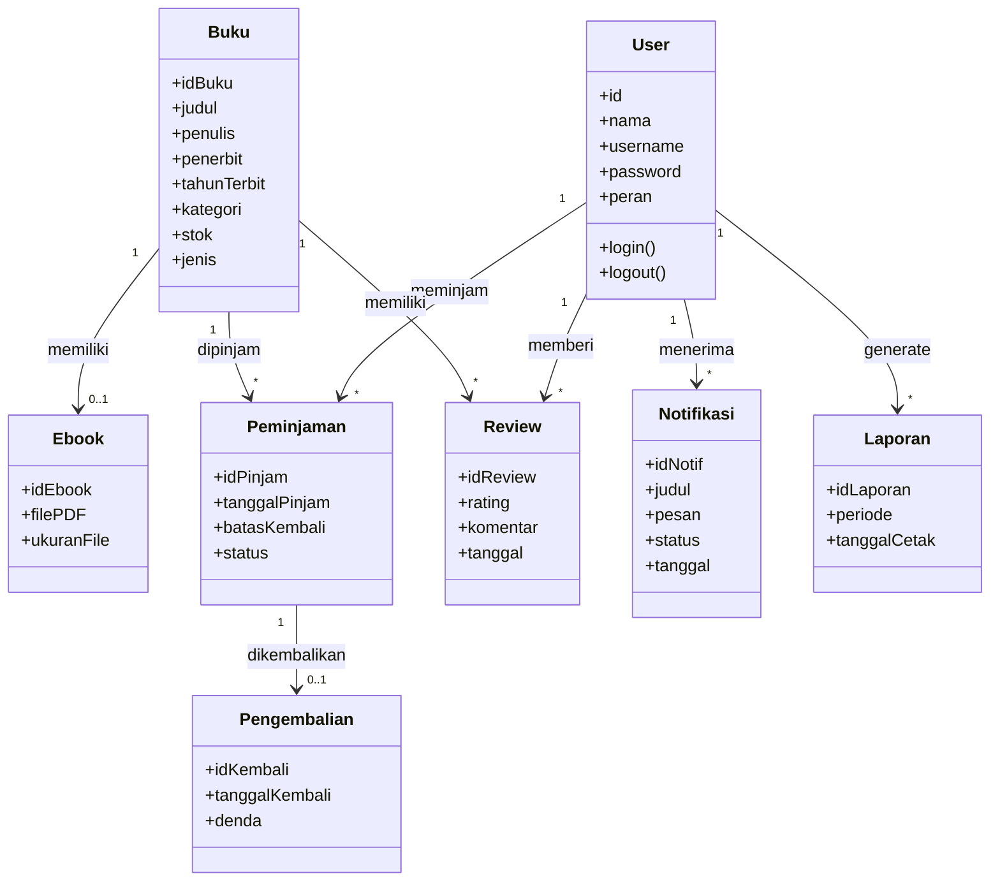

# Class Diagram

## Sistem Informasi Perpustakaan Perintis

```mermaid
classDiagram

class User{
  +id
  +nama
  +username
  +password
  +peran
  +login()
  +logout()
}

class Buku{
  +idBuku
  +judul
  +penulis
  +penerbit
  +tahunTerbit
  +kategori
  +stok
  +jenis
}

class Ebook{
  +idEbook
  +filePDF
  +ukuranFile
}

class Peminjaman{
  +idPinjam
  +tanggalPinjam
  +batasKembali
  +status
}

class Pengembalian{
  +idKembali
  +tanggalKembali
  +denda
}

class Review{
  +idReview
  +rating
  +komentar
  +tanggal
}

class Notifikasi{
  +idNotif
  +judul
  +pesan
  +status
  +tanggal
}

class Laporan{
  +idLaporan
  +periode
  +tanggalCetak
}

%% Relasi

User "1" --> "*" Peminjaman : meminjam
Buku "1" --> "*" Peminjaman : dipinjam

Peminjaman "1" --> "0..1" Pengembalian : dikembalikan

User "1" --> "*" Review : memberi
Buku "1" --> "*" Review : memiliki

User "1" --> "*" Notifikasi : menerima

Buku "1" --> "0..1" Ebook : memiliki

User "1" --> "*" Laporan : generate
```