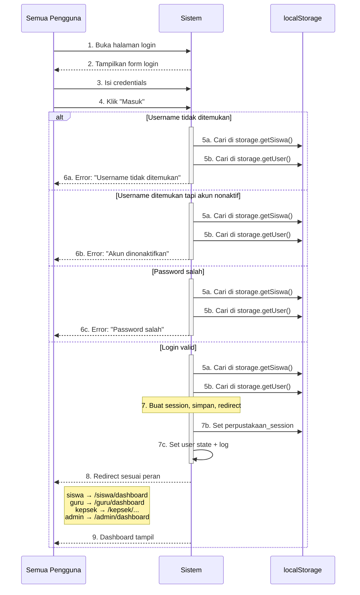
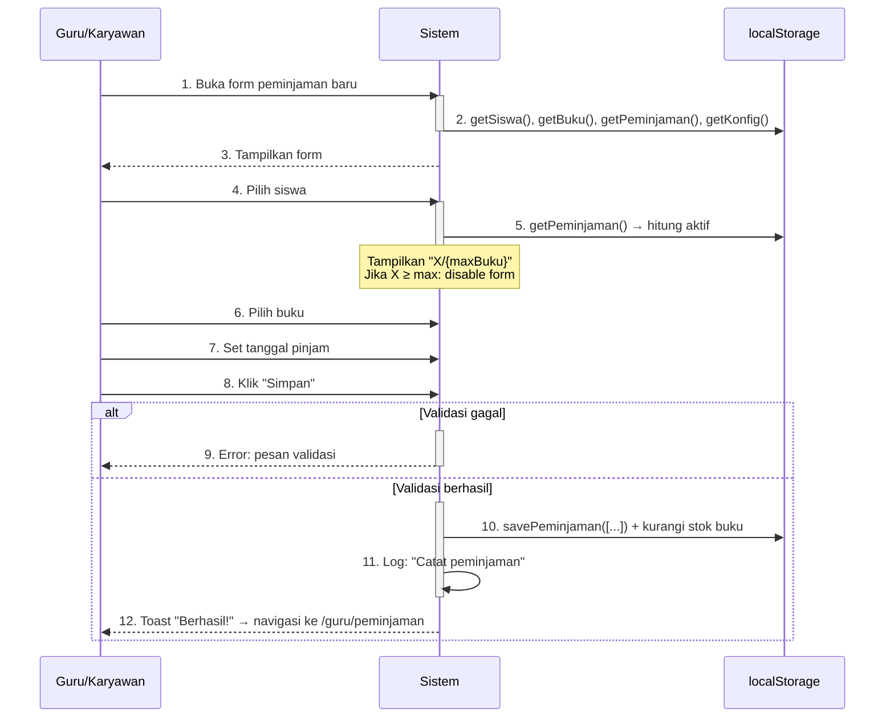
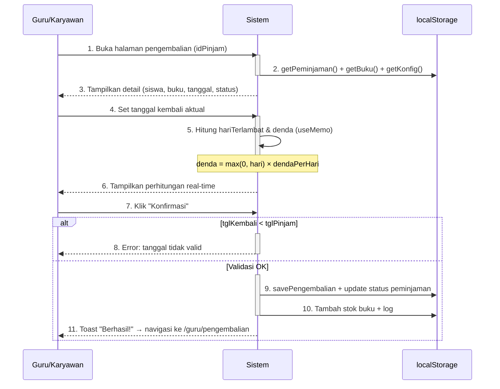
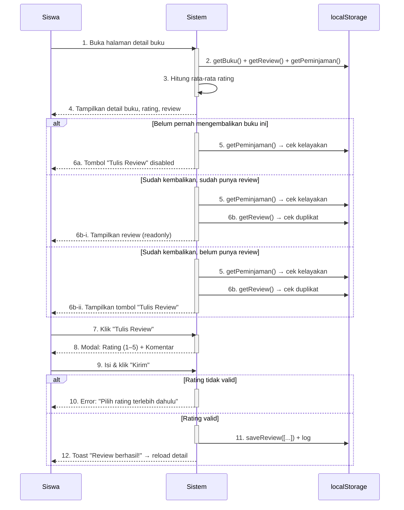

# Sequence Diagrams — Sistem Informasi Perpustakaan Perintis

Diagram sekuens berikut menggambarkan alur interaksi antara Actor, Sistem, dan komponen lain untuk empat alur utama. Semua diagram menggunakan format **Mermaid `sequenceDiagram`**.

## Legenda Elemen Mermaid

| Elemen | Keterangan | Contoh |
|---|---|---|
| `participant X as Nama` | Mendefinisikan peserta (Actor / Sistem / komponen) | `participant User as Guru/Karyawan` |
| `User->>Sistem: pesan` | Pesan synchronous (panah solid `->>`) | `User->>Sistem: 1. Buka form` |
| `Sistem-->>User: pesan` | Pesan response/asinkron (panah putus `-->>`) | `Sistem-->>User: Tampilkan form` |
| `activate Sistem` / `deactivate Sistem` | Menandai Sistem sedang memproses | Aktif saat hitung/validasi, deactive setelah response |
| `alt` ... `else` ... `end` | Percabangan kondisional | `alt ditemukan` / `else tidak ditemukan` / `end` |
| `loop` ... `end` | Pengulangan | `loop Untuk setiap pinjaman aktif` |
| `Note over X: teks` | Anotasi pada satu peserta | `Note over Sistem: denda = hari × Rp500` |

**Cara membaca:**
- Urutan pesan dari atas ke bawah = urutan waktu
- Blok `alt`/`else` menunjukkan kondisi berbeda dalam satu langkah
- Setiap cabang `alt`/`else` punya `activate`/`deactivate`-nya sendiri
- `Note` berisi anotasi singkat; detail teknis ada di "### Implementasi" di bawah tiap diagram

---

## 1. Login (UC-001)

### Implementasi
- **File:** `src/contexts/AuthContext.jsx` (baris 23–70)
- **Session object:** `{id, nama, username, peran, extra}` → `localStorage.setItem('perpustakaan_session', JSON.stringify(session))`
- **Redirect:** Berdasarkan `roleMap` pada baris 55

---

## 2. Proses Peminjaman Buku (UC-011)

### Implementasi
- **File:** `src/pages/guru/PeminjamanBaruPage.jsx`
- **Validasi stok:** Baris 50–55 (re-check sebelum simpan)
- **Pengurangan stok:** Baris 69–72 — `allBuku[idx].stok -= 1`, lalu `saveBuku(allBuku)`
- **Batas peminjaman:** `storage.getKonfig().maxBukuPerSiswa` (default: 3)
- **Durasi default:** `storage.getKonfig().batasHariPinjam` (default: 7 hari)
- **Object peminjaman:** `{idPinjam, idSiswa, idBuku, tanggalPinjam, batasKembali, status: 'dipinjam', createdAt}`

---

## 3. Proses Pengembalian Buku dengan Denda (UC-012)

### Implementasi
- **File:** `src/pages/guru/ProsesPengembalianPage.jsx`
- **Perhitungan denda real-time:** Baris 31–38 (useMemo, re-embed setiap perubahan tanggal)
- **Formula:** `denda = hariTerlambat × (konfig.dendaPerHari || 500)` — configurable
- **Pengembalian stok:** Baris 70–73 — `allBuku[idx].stok += 1`, lalu `saveBuku(allBuku)`
- **statusDenda:** `belum_bayar` jika denda > 0, `lunas` jika denda = 0
- **Object pengembalian:** `{idKembali, idPinjam, tanggalKembali, jumlahHariTerlambat, denda, statusDenda, catatan}`

---

## 4. Menulis Review Buku (UC-006)

### Implementasi
- **File:** `src/pages/siswa/DetailBukuPage.jsx`
- **Cek kelayakan review:** `pinjaman.some(p => p.idBuku === idBuku && p.idSiswa === user.id && p.status === 'dikembalikan')`
- **Cek duplikat:** `review.some(r => r.idBuku === idBuku && r.idSiswa === user.id)`
- **Rating:** Bintang 1–5, diklik langsung (komponen interaktif)
- **Rata-rata:** `Σrating / count` — dihitung ulang otomatis setelah review baru disimpan
- **Object review:** `{idReview, idBuku, idSiswa, rating, komentar, createdAt}`

---

## Catatan Implementasi

### Penyimpanan Data (localStorage Keys)
| Key | Tipe Data | CRUD Methods |
|---|---|---|
| `perpustakaan_siswa` | Array<Siswa> | `getSiswa()`, `saveSiswa()`, `addSiswa()`, `deleteSiswa()` |
| `perpustakaan_buku` | Array<Buku> | `getBuku()`, `saveBuku()` |
| `perpustakaan_pinjaman` | Array<Peminjaman> | `getPeminjaman()`, `savePeminjaman()` |
| `perpustakaan_pengembalian` | Array<Pengembalian> | `getPengembalian()`, `savePengembalian()` |
| `perpustakaan_review` | Array<Review> | `getReview()`, `saveReview()` |
| `perpustakaan_notifikasi` | Array<Notifikasi> | `getNotifikasi()`, `saveNotifikasi()` |
| `perpustakaan_user` | Array<User> | `getUser()`, `saveUser()` |
| `perpustakaan_konfig` | Object<Konfig> | `getKonfig()`, `saveKonfig()` |
| `perpustakaan_log` | Array<Log> | `getLog()`, `saveLog()`, `addLog()` |
| `perpustakaan_session` | Object<Session> | Direct localStorage access (AuthContext) |

### Alur Notifikasi (Otomatis)
Notifikasi dihasilkan secara otomatis saat siswa membuka halaman Notifikasi (`src/pages/siswa/NotifikasiPage.jsx`):

1. Filter peminjaman aktif (status: `dipinjam` atau `terlambat`) milik siswa yang login
2. Untuk setiap pinjaman, hitung `sisa = daysUntil(batasKembali)`
3. Jika `sisa ≤ 2` dan `sisa > 0`: buat notifikasi `jatuh_tempo` (jika belum ada)
4. Jika `sisa ≤ 0`: buat notifikasi `terlambat` (jika belum ada)
5. Tandai semua notifikasi sebagai `isRead: true`
