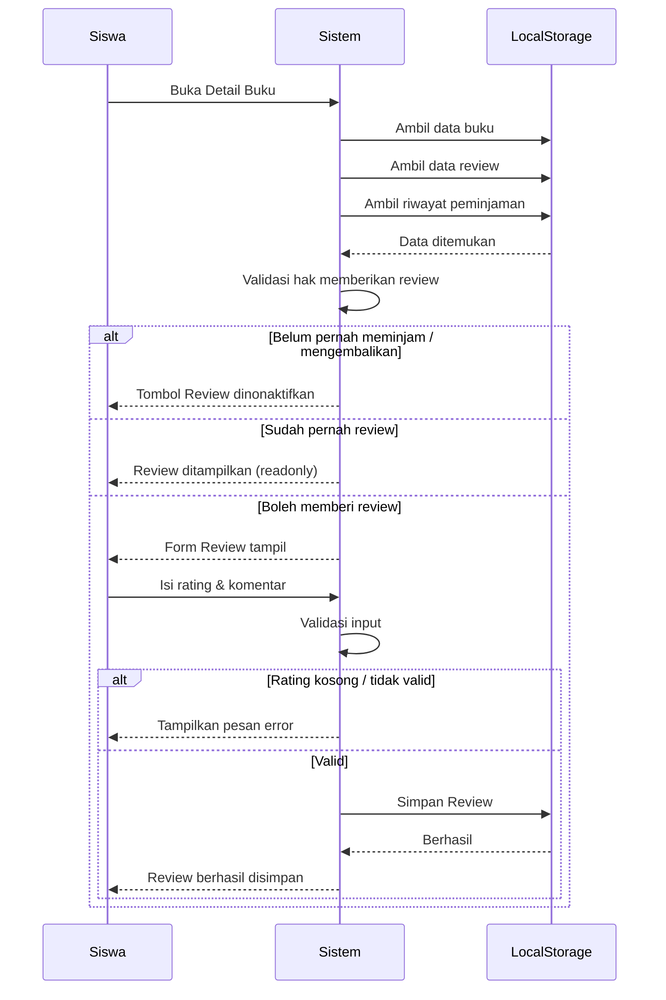

# UCIC-006 — Beri Review & Rating Buku

## Informasi Use Case

| Field | Value |
|--------|-------|
| Use Case ID | UC-006 |
| Nama | Beri Review & Rating Buku |
| Aktor | Siswa |
| Related User Flow | userflow_uc_006.md |
| Related Screen | `/siswa/katalog/:idBuku` |
| Related Entities | Buku, Review, Peminjaman, Siswa |

---

# Sequence Diagram



---

# API Contract (Prototype)

## Submit Review

### Action

```
saveReview(reviewBaru)
```

---

### Request Payload

```json
{
  "idReview": "RV001",
  "idBuku": "BK001",
  "idSiswa": "S001",
  "rating": 5,
  "komentar": "Bukunya sangat menarik.",
  "createdAt": "2026-01-15T09:30:00Z"
}
```

---

### Success Response

```json
{
  "success": true,
  "message": "Review berhasil disimpan."
}
```

---

### Error Response

```json
{
  "success": false,
  "message": "Rating wajib diisi."
}
```

---

# Validation Rules

- Siswa harus sudah login.
- Buku harus pernah dipinjam dan sudah dikembalikan.
- Satu siswa hanya boleh memberikan satu review untuk satu buku.
- Rating wajib diisi.
- Rating hanya boleh bernilai 1–5.
- Komentar bersifat opsional.

---

# Data Mapping

| Input | Entity | Field |
|--------|---------|-------|
| idReview | Review | idReview |
| idBuku | Review | idBuku |
| idSiswa | Review | idSiswa |
| rating | Review | rating |
| komentar | Review | komentar |
| createdAt | Review | createdAt |

---

# Status Codes (Prototype)

| Kondisi | Status |
|----------|--------|
| Review berhasil | SUCCESS |
| Rating kosong | VALIDATION_ERROR |
| Sudah pernah review | DUPLICATE_REVIEW |
| Belum memenuhi syarat review | FORBIDDEN |

---

# Error Handling

| Kondisi | Sistem |
|----------|---------|
| Rating kosong | Menampilkan pesan validasi |
| Sudah pernah review | Menampilkan review sebelumnya |
| Belum pernah mengembalikan buku | Tombol review dinonaktifkan |
| Gagal menyimpan | Menampilkan notifikasi gagal |

---

# Implementasi

**Storage**

- `perpustakaan_review`

**Method**

- `getReview()`
- `saveReview()`

**File**

```
src/pages/siswa/DetailBukuPage.jsx
```

**Acceptance Criteria**

- Hanya siswa yang pernah mengembalikan buku dapat memberi review.
- Rating harus antara 1–5.
- Review berhasil disimpan ke localStorage.
- Review baru langsung muncul pada detail buku.
- Nilai rata-rata rating diperbarui otomatis.