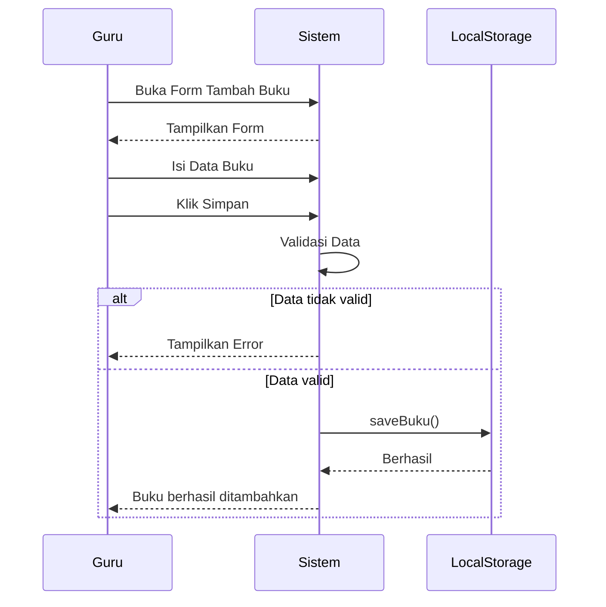

# UCIC-008 — Input Data Buku Baru

## Informasi Use Case

| Field | Value |
|--------|-------|
| Use Case ID | UC-008 |
| Nama | Input Data Buku Baru |
| Aktor | Guru/Karyawan |
| Related User Flow | userflow_uc_008.md |
| Related Screen | `/guru/kelola-buku/tambah` |
| Related Entities | Buku |

---

# Sequence Diagram



---

# API Contract (Prototype)

## Tambah Buku

### Action

```
saveBuku(dataBuku)
```

### Request Payload

```json
{
  "idBuku":"BK010",
  "judul":"Algoritma Dasar",
  "penulis":"Andi",
  "kategori":"Teknologi",
  "stok":5,
  "ebook":false
}
```

### Success Response

```json
{
  "success":true,
  "message":"Data buku berhasil ditambahkan."
}
```

### Error Response

```json
{
  "success":false,
  "message":"Judul buku wajib diisi."
}
```

---

# Validation Rules

- Guru harus login.
- Judul wajib diisi.
- Penulis wajib diisi.
- Kategori wajib dipilih.
- Stok minimal 0.
- ID Buku harus unik.

---

# Data Mapping

| Input | Entity | Field |
|--------|---------|-------|
| idBuku | Buku | idBuku |
| judul | Buku | judul |
| penulis | Buku | penulis |
| kategori | Buku | kategori |
| stok | Buku | stok |
| ebook | Buku | ebook |

---

# Status Codes

| Kondisi | Status |
|----------|--------|
| Berhasil | SUCCESS |
| Validasi gagal | VALIDATION_ERROR |
| ID sudah ada | DUPLICATE |

---

# Error Handling

| Kondisi | Sistem |
|----------|---------|
| Data kosong | Menampilkan pesan validasi |
| ID sudah digunakan | Menolak penyimpanan |
| Gagal menyimpan | Menampilkan notifikasi gagal |

---

# Implementasi

**Storage**

- `perpustakaan_buku`

**Method**

- `getBuku()`
- `saveBuku()`

**File**

```
src/pages/guru/TambahBukuPage.jsx
```

**Acceptance Criteria**

- Guru dapat menambahkan buku baru.
- Data tersimpan ke localStorage.
- Buku baru muncul di daftar katalog.