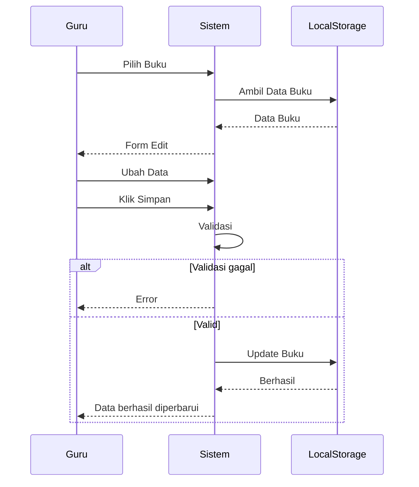

# UCIC-009 — Edit Data Buku

## Informasi Use Case

| Field | Value |
|--------|-------|
| Use Case ID | UC-009 |
| Nama | Edit Data Buku |
| Aktor | Guru/Karyawan |
| Related User Flow | userflow_uc_009.md |
| Related Screen | `/guru/kelola-buku/edit/:idBuku` |
| Related Entities | Buku |

---

# Sequence Diagram



---

# API Contract (Prototype)

## Edit Buku

### Action

```
saveBuku(updatedData)
```

### Request Payload

```json
{
  "idBuku":"BK001",
  "judul":"Matematika SMP Revisi",
  "stok":10
}
```

### Success Response

```json
{
  "success":true,
  "message":"Data berhasil diperbarui."
}
```

### Error Response

```json
{
  "success":false,
  "message":"Data tidak valid."
}
```

---

# Validation Rules

- Guru harus login.
- Buku harus tersedia.
- Judul tidak boleh kosong.
- Stok minimal 0.

---

# Data Mapping

| Input | Entity | Field |
|--------|---------|-------|
| idBuku | Buku | idBuku |
| judul | Buku | judul |
| penulis | Buku | penulis |
| kategori | Buku | kategori |
| stok | Buku | stok |

---

# Status Codes

| Kondisi | Status |
|----------|--------|
| Berhasil | SUCCESS |
| Buku tidak ditemukan | NOT_FOUND |
| Validasi gagal | VALIDATION_ERROR |

---

# Error Handling

| Kondisi | Sistem |
|----------|---------|
| Buku tidak ada | Menampilkan pesan error |
| Data kosong | Validasi gagal |
| Penyimpanan gagal | Notifikasi gagal |

---

# Implementasi

**Storage**

- `perpustakaan_buku`

**Method**

- `getBuku()`
- `saveBuku()`

**File**

```
src/pages/guru/EditBukuPage.jsx
```

**Acceptance Criteria**

- Guru dapat mengubah data buku.
- Perubahan langsung tersimpan.
- Data katalog otomatis diperbarui.