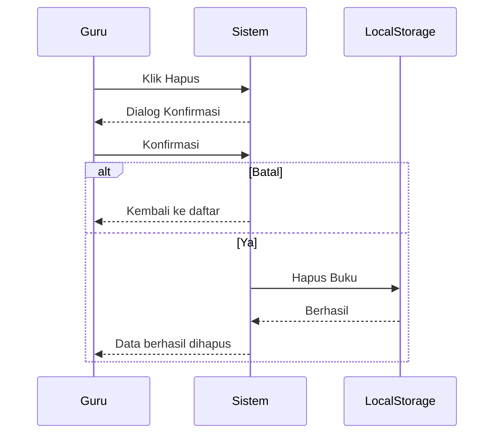

# UCIC-010 — Hapus Data Buku

## Informasi Use Case

| Field | Value |
|--------|-------|
| Use Case ID | UC-010 |
| Nama | Hapus Data Buku |
| Aktor | Guru/Karyawan |
| Related User Flow | userflow_uc_010.md |
| Related Screen | `/guru/kelola-buku` |
| Related Entities | Buku |

---

# Sequence Diagram



---

# API Contract (Prototype)

## Hapus Buku

### Action

```
deleteBuku(idBuku)
```

### Request Payload

```json
{
  "idBuku":"BK001"
}
```

### Success Response

```json
{
  "success":true,
  "message":"Buku berhasil dihapus."
}
```

### Error Response

```json
{
  "success":false,
  "message":"Buku tidak ditemukan."
}
```

---

# Validation Rules

- Guru harus login.
- Buku harus tersedia.
- Buku yang masih dipinjam tidak dapat dihapus.

---

# Data Mapping

| Input | Entity | Field |
|--------|---------|-------|
| idBuku | Buku | idBuku |

---

# Status Codes

| Kondisi | Status |
|----------|--------|
| Berhasil | SUCCESS |
| Buku tidak ditemukan | NOT_FOUND |
| Buku sedang dipinjam | CONFLICT |

---

# Error Handling

| Kondisi | Sistem |
|----------|---------|
| Buku tidak ditemukan | Menampilkan error |
| Buku sedang dipinjam | Menolak penghapusan |
| Gagal menghapus | Notifikasi gagal |

---

# Implementasi

**Storage**

- `perpustakaan_buku`

**Method**

- `deleteBuku()`
- `saveBuku()`

**File**

```
src/pages/guru/KelolaBukuPage.jsx
```

**Acceptance Criteria**

- Guru dapat menghapus buku.
- Sistem meminta konfirmasi sebelum menghapus.
- Buku hilang dari daftar katalog setelah berhasil dihapus.