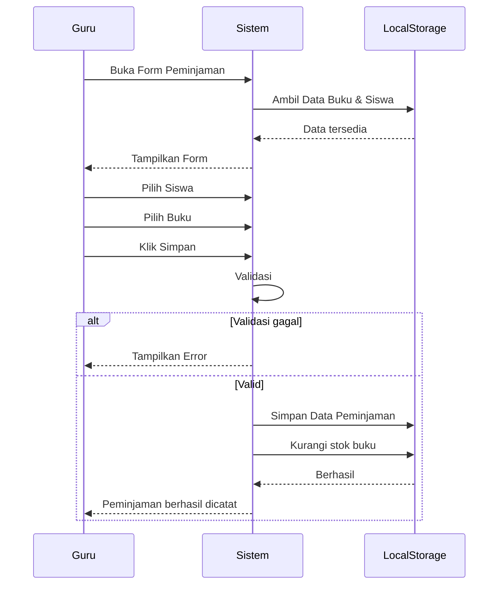

# UCIC-011 — Catat Peminjaman Baru

## Informasi Use Case

| Field | Value |
|--------|-------|
| Use Case ID | UC-011 |
| Nama | Catat Peminjaman Baru |
| Aktor | Guru/Karyawan |
| Related User Flow | userflow_uc_011.md |
| Related Screen | `/guru/peminjaman/baru` |
| Related Entities | Siswa, Buku, Peminjaman |

---

# Sequence Diagram



---

# API Contract (Prototype)

## Catat Peminjaman

### Action

```
savePeminjaman(dataPinjam)
```

### Request Payload

```json
{
"idPinjam":"PJ001",
"idSiswa":"S001",
"idBuku":"BK001",
"tanggalPinjam":"2026-01-15",
"batasKembali":"2026-01-22"
}
```

### Success Response

```json
{
"success":true,
"message":"Peminjaman berhasil."
}
```

### Error Response

```json
{
"success":false,
"message":"Stok buku habis."
}
```

---

# Validation Rules

- Guru harus login.
- Buku tersedia.
- Siswa belum melebihi batas pinjaman.
- Tanggal pinjam wajib diisi.

---

# Data Mapping

| Input | Entity | Field |
|--------|---------|-------|
| idPinjam | Peminjaman | idPinjam |
| idSiswa | Peminjaman | idSiswa |
| idBuku | Peminjaman | idBuku |
| tanggalPinjam | Peminjaman | tanggalPinjam |
| batasKembali | Peminjaman | batasKembali |

---

# Status Codes

| Kondisi | Status |
|----------|--------|
| Berhasil | SUCCESS |
| Buku habis | OUT_OF_STOCK |
| Batas pinjaman tercapai | LIMIT_EXCEEDED |

---

# Error Handling

- Menampilkan pesan jika stok habis.
- Menolak peminjaman jika batas pinjaman tercapai.
- Menampilkan notifikasi jika penyimpanan gagal.

---

# Implementasi

**Storage**

- perpustakaan_pinjaman
- perpustakaan_buku

**Method**

- getPeminjaman()
- savePeminjaman()
- getBuku()
- saveBuku()

**File**

```
src/pages/guru/PeminjamanBaruPage.jsx
```

**Acceptance Criteria**

- Guru dapat mencatat peminjaman.
- Stok buku otomatis berkurang.
- Data tersimpan ke localStorage.