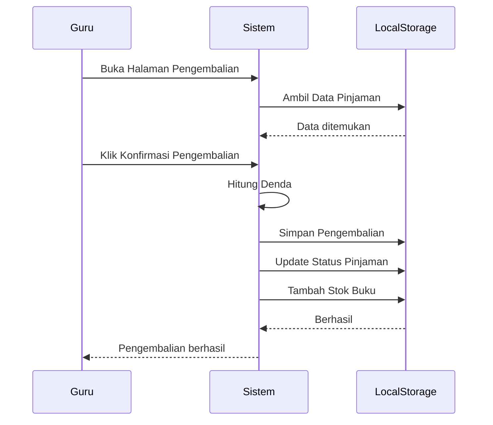

# UCIC-012 — Proses Pengembalian Buku

## Informasi Use Case

| Field | Value |
|--------|-------|
| Use Case ID | UC-012 |
| Nama | Proses Pengembalian Buku |
| Aktor | Guru/Karyawan |
| Related User Flow | userflow_uc_012.md |
| Related Screen | `/guru/pengembalian/proses/:idPinjam` |
| Related Entities | Pengembalian, Peminjaman, Buku |

---

# Sequence Diagram



---

# API Contract (Prototype)

## Pengembalian Buku

### Action

```
savePengembalian(dataPengembalian)
```

### Request Payload

```json
{
"idPinjam":"PJ001",
"tanggalKembali":"2026-01-23"
}
```

### Success Response

```json
{
"success":true,
"denda":500
}
```

### Error Response

```json
{
"success":false,
"message":"Tanggal tidak valid."
}
```

---

# Validation Rules

- Guru harus login.
- Data peminjaman tersedia.
- Tanggal kembali valid.

---

# Data Mapping

| Input | Entity | Field |
|--------|---------|-------|
| idPinjam | Pengembalian | idPinjam |
| tanggalKembali | Pengembalian | tanggalKembali |
| denda | Pengembalian | denda |

---

# Status Codes

| Kondisi | Status |
|----------|--------|
| Berhasil | SUCCESS |
| Data tidak ditemukan | NOT_FOUND |
| Validasi gagal | VALIDATION_ERROR |

---

# Error Handling

- Menampilkan pesan jika tanggal salah.
- Menolak proses jika data pinjaman tidak ditemukan.
- Menghitung denda otomatis.

---

# Implementasi

**Storage**

- perpustakaan_pengembalian
- perpustakaan_pinjaman
- perpustakaan_buku

**Method**

- savePengembalian()
- savePeminjaman()
- saveBuku()

**File**

```
src/pages/guru/ProsesPengembalianPage.jsx
```

**Acceptance Criteria**

- Status pinjaman berubah menjadi dikembalikan.
- Denda dihitung otomatis.
- Stok buku bertambah.