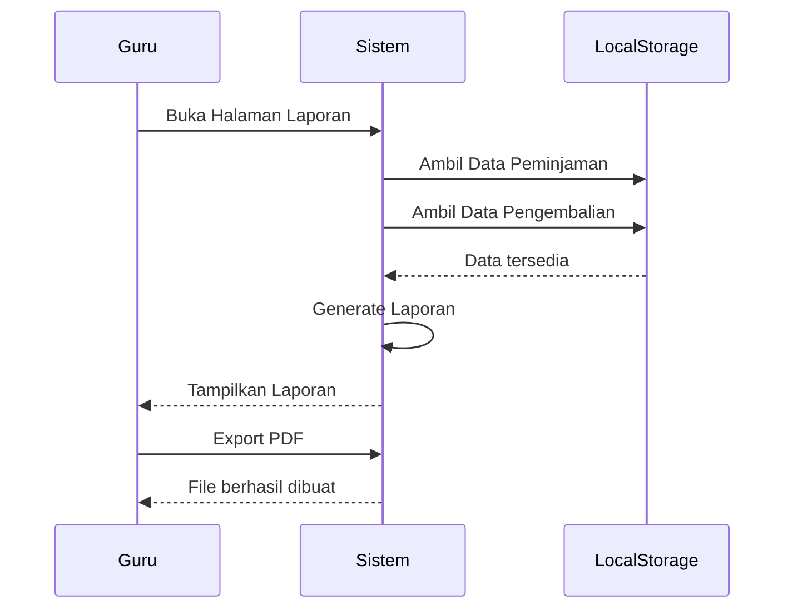

# UCIC-013 — Generate Laporan Peminjaman

## Informasi Use Case

| Field | Value |
|--------|-------|
| Use Case ID | UC-013 |
| Nama | Generate Laporan Peminjaman |
| Aktor | Guru/Karyawan |
| Related User Flow | userflow_uc_013.md |
| Related Screen | `/guru/laporan` |
| Related Entities | Peminjaman, Pengembalian |

---

# Sequence Diagram



---

# API Contract (Prototype)

## Generate Laporan

### Action

```
generateReport()
```

### Request Payload

```json
{
"periode":"Januari 2026"
}
```

### Success Response

```json
{
"success":true,
"jumlahPeminjaman":120,
"jumlahPengembalian":115
}
```

### Error Response

```json
{
"success":false,
"message":"Data laporan tidak tersedia."
}
```

---

# Validation Rules

- Guru harus login.
- Periode laporan dipilih.
- Data tersedia.

---

# Data Mapping

| Input | Entity | Field |
|--------|---------|-------|
| periode | Laporan | periode |
| peminjaman | Peminjaman | data |
| pengembalian | Pengembalian | data |

---

# Status Codes

| Kondisi | Status |
|----------|--------|
| Berhasil | SUCCESS |
| Data kosong | NO_DATA |

---

# Error Handling

- Menampilkan pesan jika data kosong.
- Menampilkan notifikasi jika gagal membuat laporan.

---

# Implementasi

**Storage**

- perpustakaan_pinjaman
- perpustakaan_pengembalian

**Method**

- getPeminjaman()
- getPengembalian()

**File**

```
src/pages/guru/LaporanPage.jsx
```

**Acceptance Criteria**

- Guru dapat melihat laporan.
- Data sesuai periode.
- Laporan dapat diekspor.