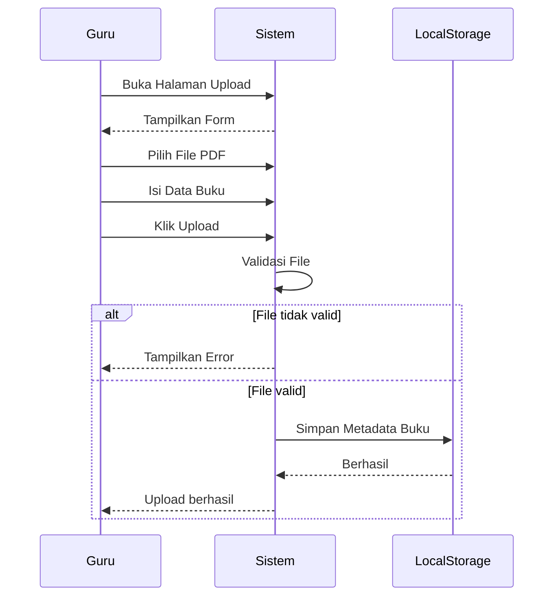

# UCIC-014 — Upload Materi Digital (E-book)

## Informasi Use Case

| Field | Value |
|--------|-------|
| Use Case ID | UC-014 |
| Nama | Upload Materi Digital (E-book) |
| Aktor | Guru/Karyawan |
| Related User Flow | userflow_uc_014.md |
| Related Screen | `/guru/upload-digital` |
| Related Entities | Buku |

---

# Sequence Diagram



## API Contract

### Action

```
uploadEbook(data)
```

### Request Payload

```json
{
"idBuku":"BK011",
"judul":"Fisika Digital",
"file":"fisika.pdf"
}
```

### Success Response

```json
{
"success":true,
"message":"E-book berhasil diupload."
}
```

### Error Response

```json
{
"success":false,
"message":"Format file tidak didukung."
}
```

## Validation Rules

- Guru harus login.
- File harus PDF.
- Ukuran file sesuai batas sistem.
- Judul wajib diisi.

## Data Mapping

| Input | Entity | Field |
|--------|---------|-------|
| idBuku | Buku | idBuku |
| judul | Buku | judul |
| file | Buku | filePdf |

## Status Codes

| Kondisi | Status |
|----------|--------|
| Berhasil | SUCCESS |
| File tidak valid | INVALID_FILE |

## Error Handling

- Menolak file selain PDF.
- Menampilkan pesan jika upload gagal.

## Implementasi

Storage

- perpustakaan_buku

Method

- saveBuku()

File

```
src/pages/guru/UploadDigitalPage.jsx
```

Acceptance Criteria

- Guru dapat mengunggah E-book.
- Metadata tersimpan.
- Buku muncul pada katalog digital.