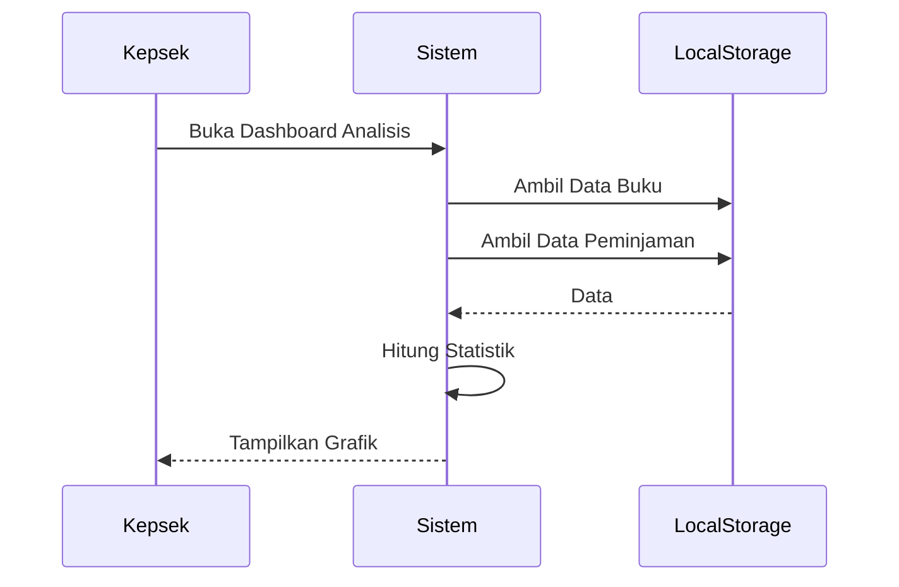

# UCIC-015 — Lihat Grafik & Analisis

## Informasi Use Case

| Field | Value |
|--------|-------|
| Use Case ID | UC-015 |
| Nama | Lihat Grafik & Analisis |
| Aktor | Kepala Sekolah |
| Related User Flow | userflow_uc_015.md |
| Related Screen | `/kepsek/grafik`, `/kepsek/minat-baca` |
| Related Entities | Buku, Peminjaman |

---

# Sequence Diagram



## API Contract

### Action

```
generateAnalytics()
```

### Request Payload

```json
{
"periode":"2026"
}
```

### Success Response

```json
{
"success":true,
"jumlahPinjam":320
}
```

### Error Response

```json
{
"success":false,
"message":"Data tidak tersedia."
}
```

## Validation Rules

- Kepala Sekolah harus login.

## Data Mapping

| Input | Entity | Field |
|--------|---------|-------|
| Data Buku | Buku | seluruh data |
| Data Pinjam | Peminjaman | seluruh data |

## Status Codes

| Kondisi | Status |
|----------|--------|
| Berhasil | SUCCESS |
| Tidak ada data | NO_DATA |

## Error Handling

- Menampilkan pesan jika data kosong.

## Implementasi

Storage

- perpustakaan_buku
- perpustakaan_pinjaman

Method

- getBuku()
- getPeminjaman()

File

```
src/pages/kepsek/GrafikPage.jsx
```

Acceptance Criteria

- Grafik tampil.
- Statistik sesuai data.