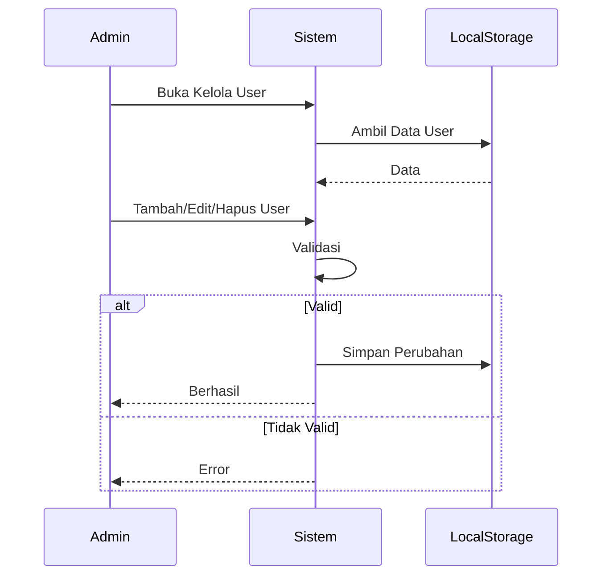

# UCIC-016 — Kelola Akun Pengguna

## Informasi Use Case

| Field | Value |
|--------|-------|
| Use Case ID | UC-016 |
| Nama | Kelola Akun Pengguna |
| Aktor | Admin |
| Related User Flow | userflow_uc_016.md |
| Related Screen | `/admin/kelola-user` |
| Related Entities | User |

---

# Sequence Diagram



## API Contract

### Action

```
saveUser()
```

### Request Payload

```json
{
"id":"USR001",
"nama":"Budi",
"role":"guru"
}
```

### Success Response

```json
{
"success":true
}
```

### Error Response

```json
{
"success":false
}
```

## Validation Rules

- Admin harus login.
- Username unik.
- Role wajib dipilih.

## Data Mapping

| Input | Entity | Field |
|--------|---------|-------|
| id | User | id |
| nama | User | nama |
| role | User | role |

## Status Codes

| Kondisi | Status |
|----------|--------|
| Berhasil | SUCCESS |
| Username sudah ada | DUPLICATE |

## Error Handling

- Menampilkan validasi.
- Menolak username yang sama.

## Implementasi

Storage

- perpustakaan_user

Method

- getUser()
- saveUser()

File

```
src/pages/admin/KelolaUserPage.jsx
```

Acceptance Criteria

- Admin dapat CRUD user.
- Data langsung diperbarui.