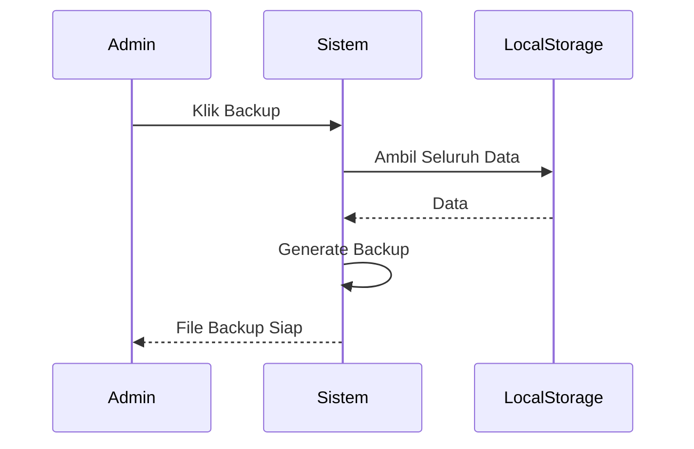

# UCIC-017 — Backup & Maintenance Sistem

## Informasi Use Case

| Field | Value |
|--------|-------|
| Use Case ID | UC-017 |
| Nama | Backup & Maintenance Sistem |
| Aktor | Admin |
| Related User Flow | userflow_uc_017.md |
| Related Screen | `/admin/backup`, `/admin/log-aktivitas` |
| Related Entities | Log, Backup |

---

# Sequence Diagram



## API Contract

### Action

```
backupSystem()
```

### Request Payload

```json
{}
```

### Success Response

```json
{
"success":true,
"backup":"backup_2026.json"
}
```

### Error Response

```json
{
"success":false
}
```

## Validation Rules

- Admin harus login.
- Seluruh data berhasil dibaca.

## Data Mapping

| Input | Entity | Field |
|--------|---------|-------|
| Semua Storage | Backup | seluruh data |

## Status Codes

| Kondisi | Status |
|----------|--------|
| Berhasil | SUCCESS |
| Backup gagal | FAILED |

## Error Handling

- Menampilkan pesan gagal backup.
- Menampilkan log aktivitas.

## Implementasi

Storage

- seluruh localStorage aplikasi

Method

- exportData()
- getLog()
- saveLog()

File

```
src/pages/admin/BackupPage.jsx
src/pages/admin/LogAktivitasPage.jsx
```

Acceptance Criteria

- Admin dapat membuat backup.
- File backup berhasil dibuat.
- Aktivitas backup tercatat pada log.