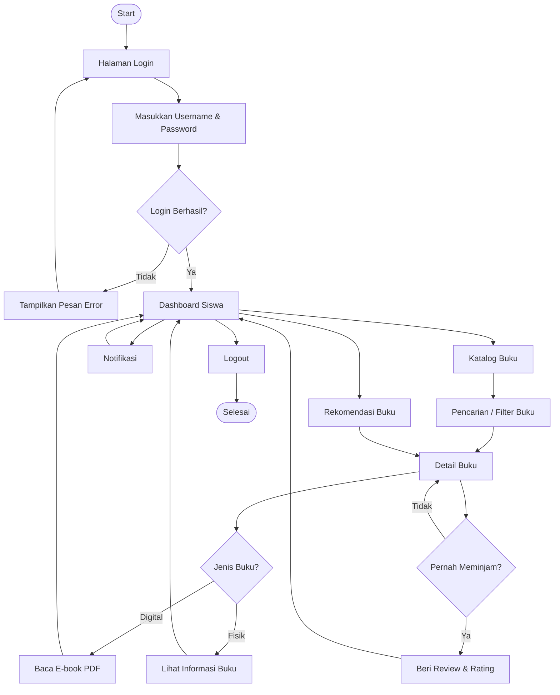
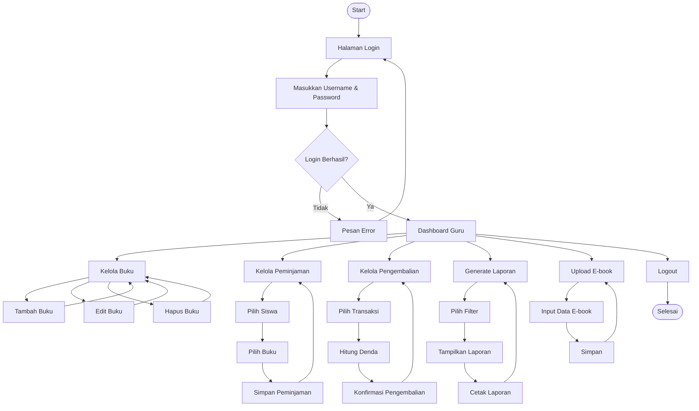
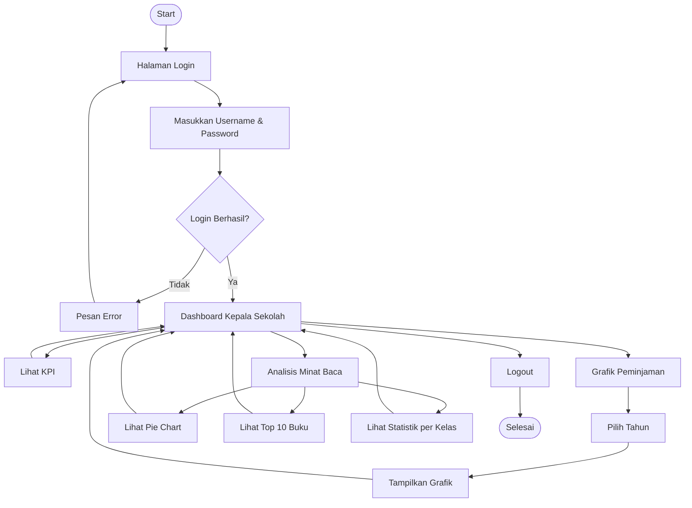
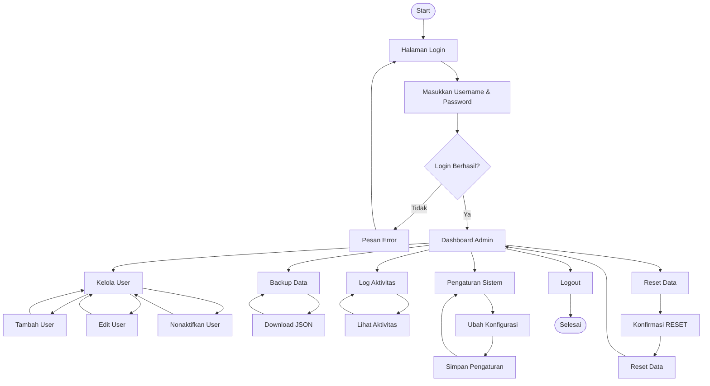

# User Flow Diagram

Dokumen ini menggambarkan alur navigasi pengguna pada Sistem Informasi Perpustakaan Perintis berdasarkan masing-masing aktor.

---

# 1. User Flow Siswa

---

# 2. User Flow Guru / Karyawan

---

# 3. User Flow Kepala Sekolah

---

# 4. User Flow Admin

---

## Keterangan

Diagram di atas menggambarkan alur navigasi utama setiap aktor dalam menggunakan Sistem Informasi Perpustakaan Perintis. Diagram ini disusun berdasarkan Use Case UC-001 sampai UC-017 dan menjadi penghubung antara Use Case Specification dengan Sequence Diagram pada tahap perancangan sistem.