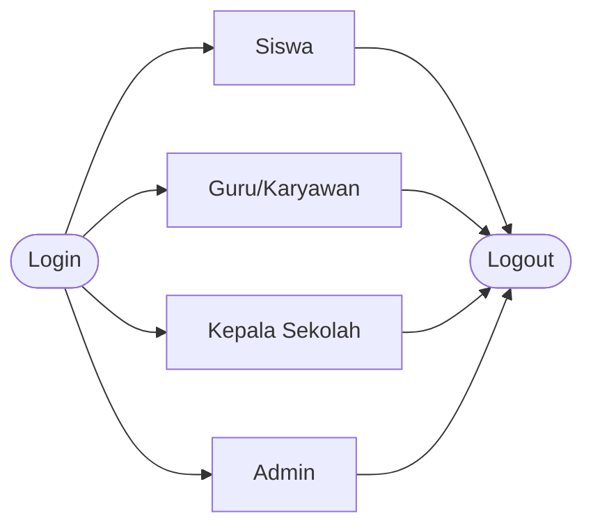
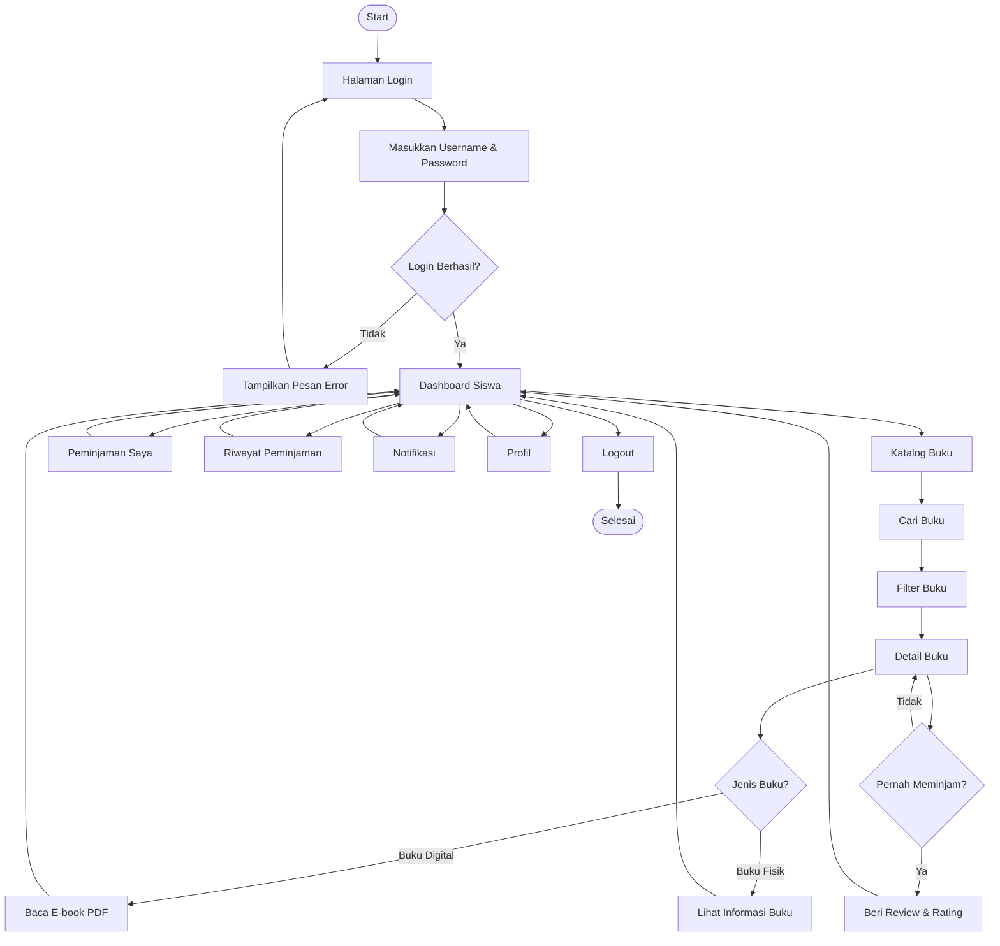
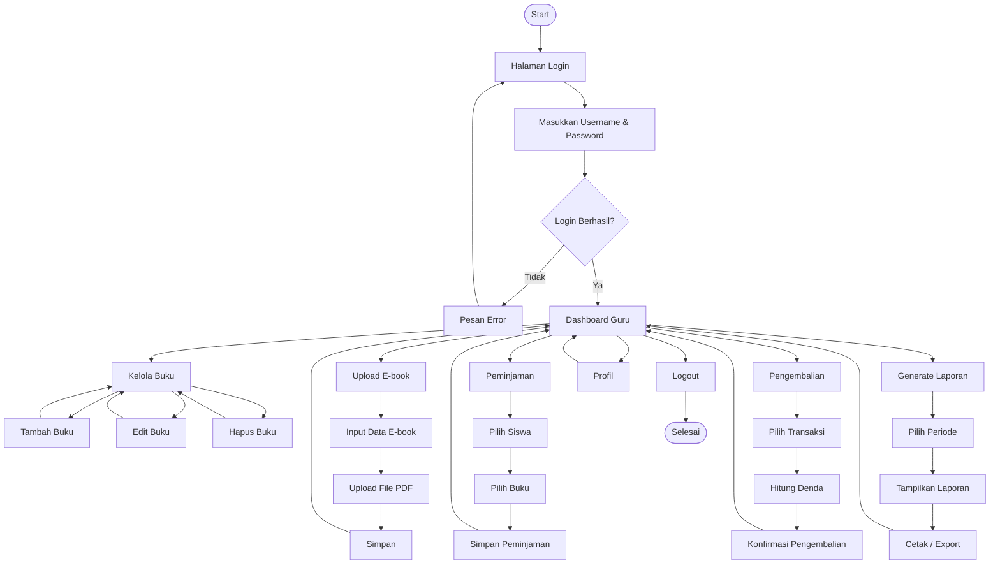
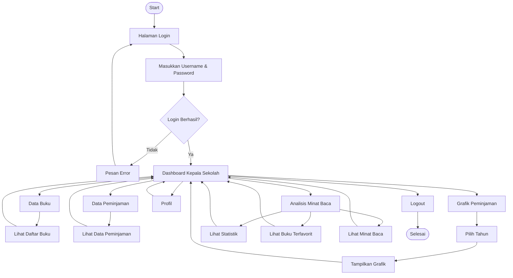
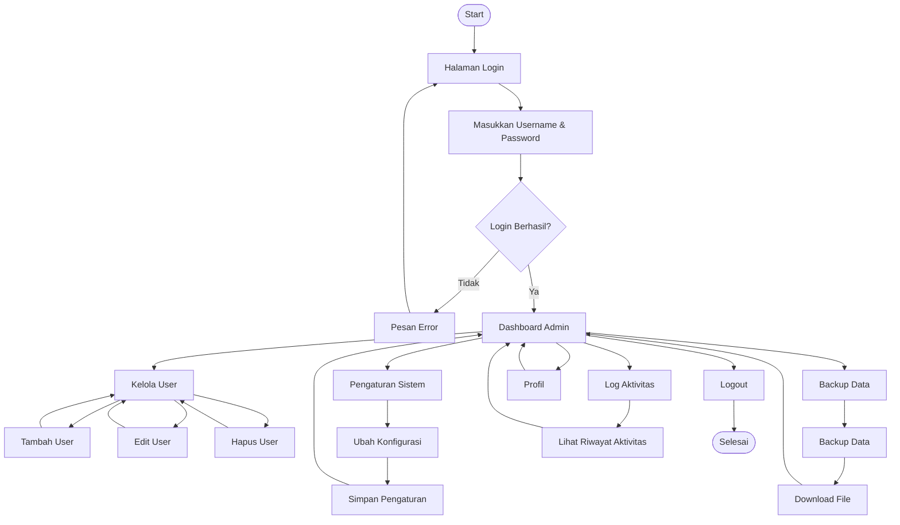

# User Flow Diagram

Dokumen ini menggambarkan alur navigasi utama setiap aktor pada Sistem Informasi Perpustakaan Perintis. Diagram disusun berdasarkan Use Case UC-001 sampai UC-017 dan menjadi acuan dalam perancangan antarmuka, class diagram, serta implementasi sistem.

---

# Overview User Flow

---

# 1. User Flow Siswa

---

# 2. User Flow Guru / Karyawan

---

# 3. User Flow Kepala Sekolah

---

# 4. User Flow Admin

---

# Keterangan

- Seluruh aktor harus melakukan login sebelum mengakses sistem.
- Semua alur mengacu pada Use Case UC-001 sampai UC-017.
- Diagram ini menjadi dasar penyusunan Sequence Diagram, Class Diagram, UCIC, dan implementasi aplikasi.
- Data pada prototype disimpan menggunakan **localStorage** sehingga seluruh alur dapat langsung diuji menggunakan dummy data.